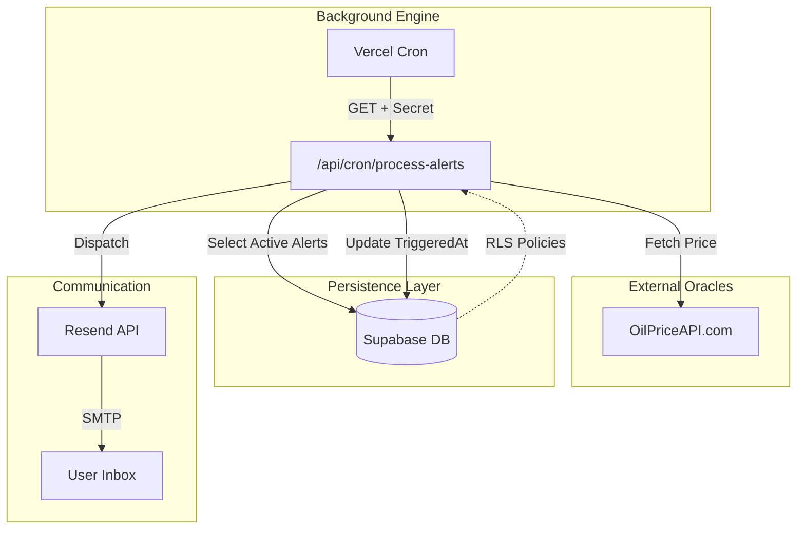
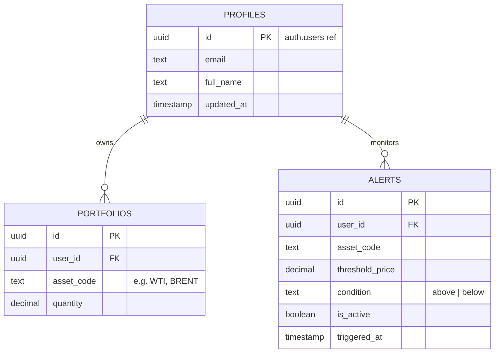

# AI Agent Operations Guide & System Context

This document is the **Ground Truth** for any AI agent interacting with the Oil Price Tracker SaaS. It defines architectural mandates, engineering patterns, and operational safety protocols that must be strictly followed.

---

## System Blueprint

### High-Level Data Flow
This diagram illustrates the lifecycle of a price alert from external oracle to user notification.



---

## Technical Foundation

### The "Sovereign" Stack
| Tier | Tool | Rationale |
| :--- | :--- | :--- |
| **Runtime** | [Bun](https://bun.sh/) or [Node.js](https://nodejs.org/) | Performance, server-side scaling, and modern TypeScript support. |
| **Package Manager** | [pnpm](https://pnpm.io/) | Fast, disk-efficient, and strict dependency management (Strictly Mandated). |
| **Framework** | Next.js 15 (App Router) | Server-side rendering (RSC) and serverless function integration. |
| **Testing** | [Vitest](https://vitest.dev/) | High-performance testing with native ESM support and JSDOM. |
| **Auth/DB** | Supabase | Managed PostgreSQL, Row Level Security (RLS) for data isolation. |
| **DX** | Biome + Oxlint | 100x faster than Prettier/ESLint; unified linting and formatting. |
| **Validation** | Zod | Runtime schema validation for environments and external API data. |

### Directory Architecture
```text
.
├── src/
│   ├── app/            # Next.js Routes & API Endpoints
│   │   ├── api/cron/   # Background workers (Protected by Secrets)
│   │   └── layout.tsx  # Root UI Shell
│   ├── lib/            # Shared logic (The "Service Layer")
│   │   ├── supabase.ts # Client & Admin clients
│   │   ├── env.ts      # Strict environment validation
│   │   └── utils.ts    # UI helper utilities
│   └── components/     # (Placeholder) Atomic UI components
└── supabase/           # Database migrations and schema definitions
```

---

## Database & RLS Protocol

### Entity Relationship Diagram (ERD)
Users are managed via Supabase Auth, which triggers profile creation.



> [!CAUTION]
> **RLS is Mandated**: Every table must have RLS enabled. Profiles/Alerts/Portfolios use `auth.uid() = user_id` for isolation. Never perform a `SELECT *` without a `user_id` filter unless using `supabaseAdmin` for system-wide tasks.

---

## Senior Engineering Patterns

### 1. Separation of Concerns (DRY)
- **Business Logic belongs in `src/lib`**: Do not write complex logic inside API routes. Create a service file in `lib/` to handle calculations or data transformations.
- **Client Selection**:
    - **Client-Side/UI**: Use `supabase` (the default client) to respect user permissions.
    - **Background Jobs**: Use `supabaseAdmin` to bypass RLS when acting as the system service (e.g., matching prices across all user alerts).

### 2. Strict Environment Pattern
- Never use `process.env` directly. 
- Always import `env` from `@/lib/env`. 
- If adding a new key, update the `envSchema` in `src/lib/env.ts` first.

### 3. Error Handling
- Use `Zod` to validate all external API responses (like OilPriceAPI). 
- All API routes must return standardized JSON responses: `{ success: boolean, data?: any, error?: string }`.

### 4. SOLID: Single Responsibility Principle (SRP)
- Each module, class, or function should have one reason to change. 
- Keep components focused on UI logic, and move data fetching or calculations to dedicated service files in `@/lib`.

### 5. KISS: Keep It Simple, Stupid
- Prioritize clear, readable code over clever or overly abstracted solutions. 
- Avoid unnecessary architectural layers unless the complexity of the feature strictly requires it.

### 6. Dependency Inversion Principle (DIP)
- Depend on abstractions, not concretions. 
- Use the service layer in `src/lib` to abstract external integrations (like Supabase or OilPriceAPI), making it easier to mock or swap dependencies during testing.

### 7. Lazy Initialization Pattern
- **Mandate**: All environmental and external service initializations (e.g., `createClient`) must be wrapped in a **Lazy Getter** or exported via a **Proxy**.
- **Reason**: This ensures that modules can be imported during the Next.js build-phase static analysis without causing premature side-effects or crashing the compiler due to missing secrets.
- **Example**: See [`src/lib/supabase.ts`](file:///c:/Users/johnr/Downloads/Oil-Price-Tracking-Site/src/lib/supabase.ts).

### 8. Testing-First Culture
- Every core utility in `src/lib` must have a corresponding `.test.ts` file.
- Before introducing new logic, ensure the environment is stubbed correctly using `vi.stubEnv` to prevent Zod validation failures during tests.

---

## Agent Workflow Checklist

Before committing any change, follow this "Definition of Done":

1. [ ] **Environment Check**: Did I add a new key? Is it in `env.ts`?
2. [ ] **Lint/Format**: Run `pnpm run lint` and `pnpm run format`.
3. [ ] **Test Coverage**: Keep the suite green. Run `pnpm run test:run`.
4. [ ] **Type Safety**: No `any` types. Ensure interfaces match the `schema.sql`.
5. [ ] **Database Integrity**: If schema changed, did I update `supabase/schema.sql`?
6. [ ] **Safety**: Check that `supabaseAdmin` isn't used where a user session exists.
7. [ ] **Lazy-Check**: Verify lazy getters and run `pnpm run build` for total confirmation.

---

## Common Gotchas
- **Package Management**: This project uses `pnpm-lock.yaml`. Do not run `npm install` or `bun install`. Always use `pnpm` to ensure strict dependency resolution.
- **Hybrid Imports**: Ensure you use the `@/*` path alias for `src/` imports to maintain clean directory navigation.
- **Trigger Latency**: The `handle_new_user` trigger runs on Supabase. If profiles aren't appearing locally, ensure the SQL has been applied to your local or staging DB.
- **Build Isolation**: Next.js scans the project root for `.ts` files. Always ensure `vitest.config.ts` and `src/**/*.test.ts` are excluded in `tsconfig.json` to prevent dev-dependency resolution errors during a production build.

